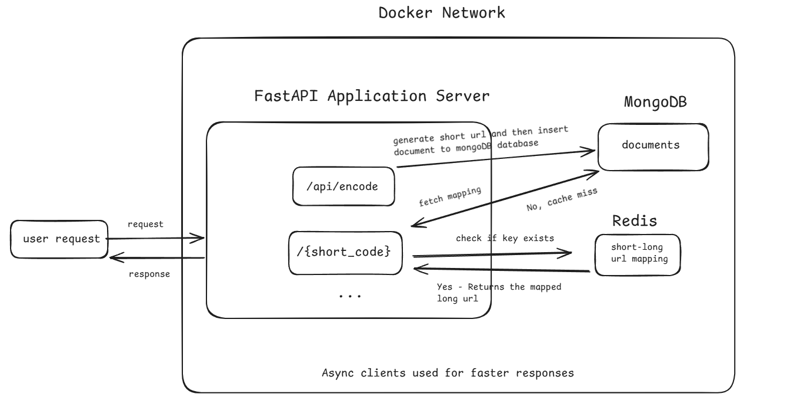

# URL Shortener Service

This is a FastAPI application that uses MongoDB and Redis for data storage and caching. The application includes lifecycle management to handle the initialization and cleanup of these resources.

## Features

- FastAPI for building the web application
- MongoDB for data storage
- Redis for caching
- Lifecycle management for resource initialization and cleanup

## Requirements

- Python 3.7+
- FastAPI
- Motor (Async MongoDB driver)
- redis (Redis client with async support)

### Docker Workflow Diagram



## Installation

1. Clone the repository:

```bash
git clone https://github.com/VarunArora14/url-shortener-system-design.git
cd url-shortener-system-design
```

2. Create a virtual environment and activate it:

```bash
python -m venv venv
source venv/bin/activate  # On Windows use `venv\Scripts\activate`
```

3. Install the dependencies:

```bash
pip install -r requirements.txt
```

## Configuration

Ensure you have MongoDB and Redis running on your machine or accessible from your application. Update the connection details in your application code if necessary. For running redis via docker container, make sure the latest version of docker is installed and run the following command -

```bash
docker run -d --name redis -p 6379:6379 redis
```

## Running the Application independently

To run the FastAPI application, use the following command:

```bash
uvicorn fapp:app --port 5000
```

This will start the application in development mode with auto-reload enabled. Make sure mongodb local client is running or run it via docker as well like redis.

## Application Structure

- fapp.py

: Main application file containing the FastAPI app and lifecycle management.

## Lifecycle Management

The application uses an asynchronous context manager to handle the lifecycle of MongoDB and Redis connections. The

lifecycle

function initializes the connections on startup and closes them on shutdown.

```python
@asynccontextmanager
async def lifecycle(app: FastAPI):
    app.state.db, app.state.collection = await initMongo()  # Initialize MongoDB
    app.state.redis = await async_get_redis_client()  # Initialize Redis
    yield  # Hand control to FastAPI
    await app.state.db.client.close()  # Close MongoDB connection
    await app.state.redis.close()  # Close Redis connection
```

## Endpoints

- `GET /`: Root endpoint that interacts with Redis.
- `POST /api/encode`: Endpoint to shorten a URL. Expects a JSON body with a `long_url` field.

```json
{
  "long_url": "https://example.com"
}
```

- `GET /{short_code}`: Endpoint to redirect to the long url. Since no DNS routes are setup, we use localhost routing with this `short_code` as the param
- `GET /health` - Health endpoint of Redis and MongoDB connection
- `GET /docs` - Swagger documentation of other list endpoints

### Docker Compose for Entire Application

Run commands in sequence -

- `docker-compose build --no-cache`
- `docker-compose up -d` (detach mode)

### Populate the MongoDB with data

Run file **url_post_req.py** to make post requests to populate the DB and check endpoints `/api/urls` for documents added.

### Understand More

Refer to file **Notes.md** which includes the system design choices used to build this and ideal url shortener system in cluster setup.
